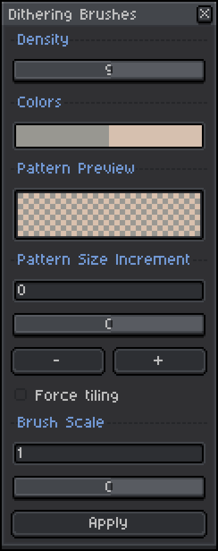

# Aseprite Dithering Brushes

Shield: [![CC BY-NC-SA 4.0][cc-by-nc-sa-shield]][cc-by-nc-sa]

## License

This work is licensed under a
[Creative Commons Attribution-NonCommercial-ShareAlike 4.0 International License][cc-by-nc-sa].

[![CC BY-NC-SA 4.0][cc-by-nc-sa-image]][cc-by-nc-sa]

[cc-by-nc-sa]: http://creativecommons.org/licenses/by-nc-sa/4.0/
[cc-by-nc-sa-image]: https://licensebuttons.net/l/by-nc-sa/4.0/88x31.png
[cc-by-nc-sa-shield]: https://img.shields.io/badge/License-CC%20BY--NC--SA%204.0-lightgrey.svg

## Overview

This project is a script/extension for [aseprite](https://aseprite.org) that provides a tool to generate dithering brushes.

## Features

The 'Dithering Brushes' tool is available in the 'Edit' menu.

**Density** controls the balance between the foreground and background colors. A higher density means that more of the pattern will be occupied by the foreground color.

The **colors** displayed are linked to the current foreground/background colors, and cannot be changed through the 'Dithering Brushes' menu directly.

The **pattern preview** shows the pattern associated with the current density using the current foreground/background colors.

The **pattern size increment** refers to the number of pixels by which the pattern should be expanded. Dithering patterns have a fixed minimum size of 4x4 pixels, so a pattern size increment of 2 will tile the 4x4 pattern into a 6x6 space. If **force tiling** is checked, increment values will be clamped to multiples of 4 to ensure that patterns tile perfectly. Patterns may not tile correctly for other increments. Negative values are not supported. For best results, use multiples of 4.

The **brush scale** refers to a scale factor that is applied to the incremented pattern. For a brush scale of 2, the 6x6 pattern from before will be scaled into a 12x12 brush. Values less than or equal to zero are not supported.